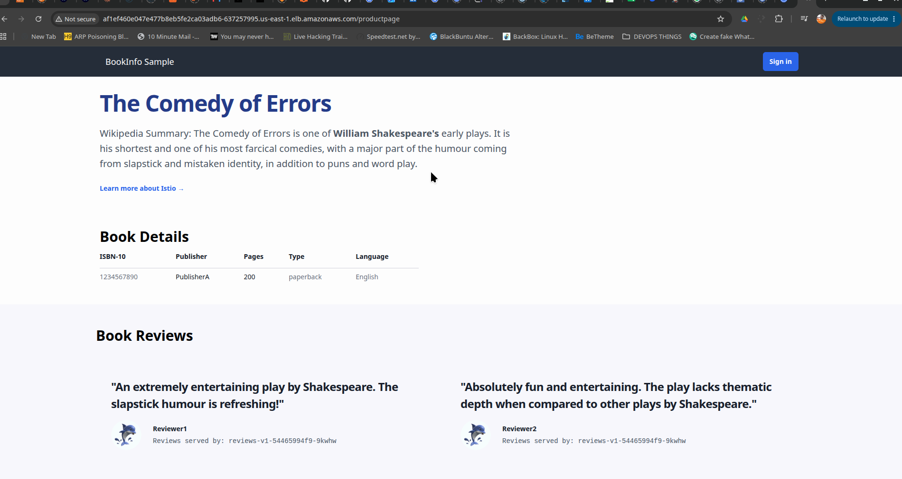

# Service-Mesh-with-Istio
This Explores the benefits and advantages of service mesh using istio. as a better service to service secure/encrypted communication, Better  Load Balancing traffic routing , Observability and failovers.

- [x] Useful links to this project by istio [Istio official Bookinfo Guide](https://istio.io/latest/docs/examples/bookinfo/) 
- [x] Direct github repo to the project by istio [Click here](https://github.com/istio/istio/tree/master/samples/bookinfo)

# 1) Set up a Kubenetes Cluster

Awscli, Terraform(IaC) . Kubectl , Ekctl,


# 2) Install and set up istio

```yaml
curl -L https://istio.io/downloadIstio | sh -
cd istio-1.30.3
export PATH=$PWD/bin:$PATH

```

