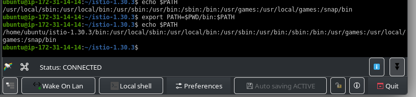
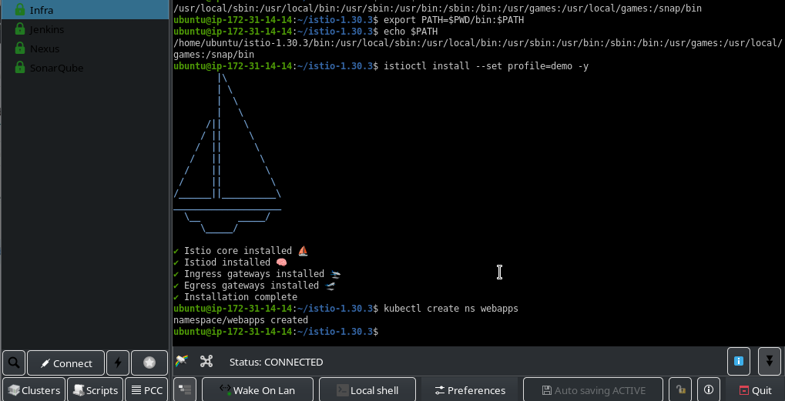
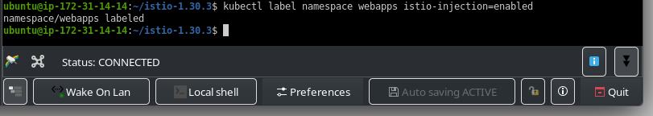
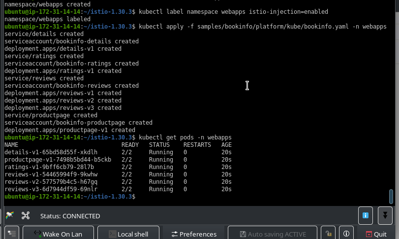
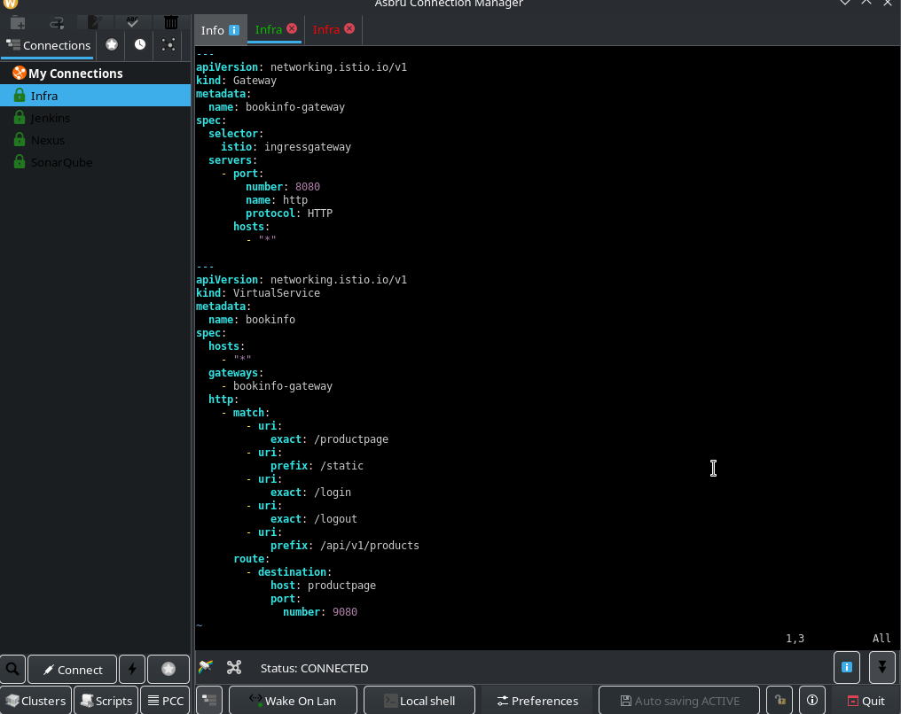
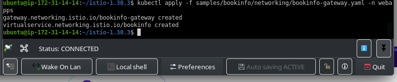
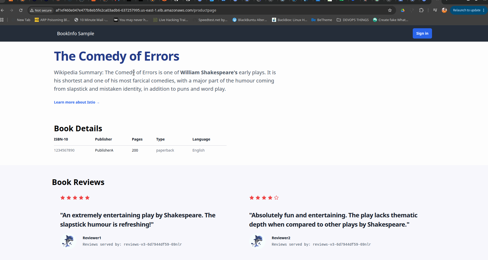
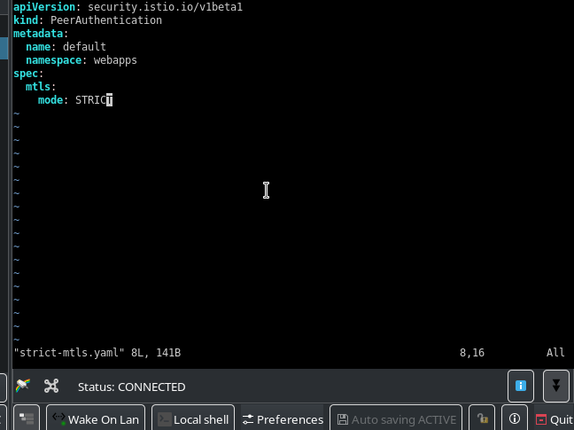
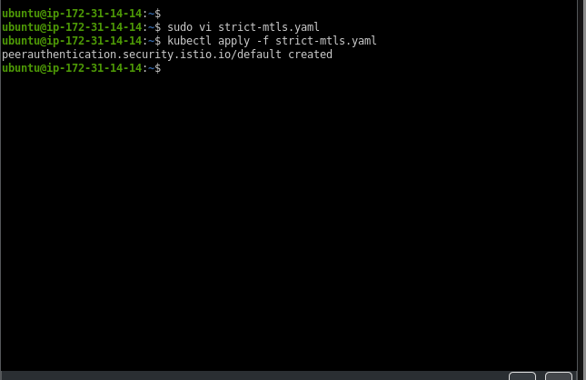

# Service-Mesh-with-Istio
This Explores the benefits and advantages of service mesh using istio. as a better service to service secure/encrypted communication, Better  Load Balancing traffic routing , Observability and failovers.

- [x] Useful links to this project by istio [Istio official Bookinfo Guide](https://istio.io/latest/docs/examples/bookinfo/) 
- [x] Direct github repo to the project by istio [Click here](https://github.com/istio/istio/tree/master/samples/bookinfo)

# 1) Set up a Kubenetes Cluster

Awscli, Terraform(IaC) . Kubectl , Ekctl,


# 2) Download istio and also add bin directory to the system path

```yaml
curl -L https://istio.io/downloadIstio | sh -
cd istio-1.30.3
export PATH=$PWD/bin:$PATH

```




# 3) Install Istio using istioctl 
`istioctl install --set profile=demo -y`
this installs the istio control plane `istiod` `istio-ingressgateway` and `istio-egressgateway` etc


# 4) create and Label Namespace for Auto Sidecar Injection
This means that every pod inside the namespace will be attached with istio's Envoy sidecar container 
```
kubectl create ns webapps
kubectl label namespace webapps istio-injection=enabled

```


# 5) Deploy the sample App (Bookinfo)
`kubectl apply -f samples/bookinfo/platform/kube/bookinfo.yaml -n webapps`
This deploys:
    • productpage, details, reviews, ratings microservices

  

# 6) Expose App via Istio Gateway
Istio gateway will sit in front of the application as the Loadbalancer just like Nginx ingress or Gateway API.       But in this case since I'm are using service mesh to interact with our microservices it will be forwarding requests to the Envoy        sidecar containers attached to the various pods via mtls which         talks to thier respective pods securely.

**Get EXTERNAL IP:**
`kubectl get svc istio-ingressgateway -n istio-system`




>Application is exposed




# 7) Enable mTLS for the App



